# Retail Sales Analytics — MySQL Portfolio Project

A relational database built from a real, publicly available, 1-million-row+ retail transaction export (`online_retail_II.csv`), designed, normalized, cleaned, and analyzed entirely in MySQL 8.0 / MySQL Workbench 8.0 CE.

This project follows a full analyst/data-engineer workflow: understanding raw data → designing a normalized schema → enforcing integrity with keys and constraints → staging and cleaning a messy real-world CSV → and finally querying, aggregating, and optimizing the result.

---

## Tech Stack

- **MySQL 8.0**
- **MySQL Workbench 8.0 CE**
- **Dataset:** [Online Retail II](https://archive.ics.uci.edu/dataset/502/online+retail+ii) — 1,067,371 raw transaction rows, Dec 2009–Dec 2011, 43 countries

---

## 1. Understanding & Profiling the Dataset

Before designing anything, the raw CSV was profiled directly rather than assumed. Key findings that shaped every decision below:

- 1,067,371 rows across 8 flat columns (`Invoice`, `StockCode`, `Description`, `Quantity`, `InvoiceDate`, `Price`, `Customer ID`, `Country`)
- 243,007 rows with a missing `Customer ID` — legitimate guest orders, not errors
- 19,494 invoices prefixed `C` — cancellations
- 22,950 rows with negative quantity, 6,225 with zero/negative price
- 1,232 stock codes with more than one description on record (inconsistent manual data entry)
- `Customer ID` stored as decimal-formatted text (e.g. `"13085.0"`)

## 2–3. Identifying Entities & Designing the Schema

Four entities were identified from the flat file: **customers**, **products**, **invoices**, and **invoice_items** (a junction table resolving the many-to-many relationship between invoices and products). `unit_price` deliberately lives in `invoice_items`, not `products`, since price is captured *at the time of sale* — protecting historical accuracy if a product's price ever changes.

## 4. Normalization

The design was checked against 1NF, 2NF, and 3NF. All three passed by construction — notably, `Country` correctly lives in `customers` (not `invoices`), since it describes the customer directly and has no transitive dependency.

---

## 5. Database Creation

```sql
CREATE DATABASE IF NOT EXISTS retail_sales_analytics
CHARACTER SET utf8mb4
COLLATE utf8mb4_general_ci;
```

`utf8mb4` was chosen over legacy `utf8` to correctly support the full range of international text across 43 countries.

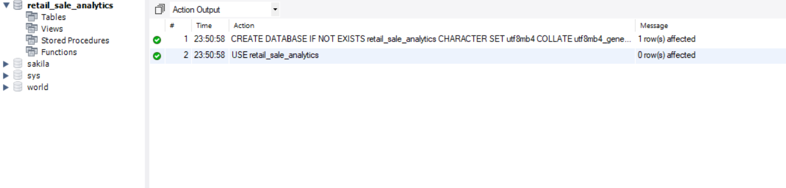

## 6–7. Creating Tables & Choosing Primary Keys

Four tables were created with data types chosen from evidence gathered in Step 1 — for example, `invoice_no` is `VARCHAR(10)`, not `INT`, specifically because cancellation invoices contain a letter prefix. `customer_id`, `stock_code`, and `invoice_no` use natural keys; `invoice_items` uses a surrogate `AUTO_INCREMENT` key (`item_id`), since no natural combination of its columns is guaranteed unique.

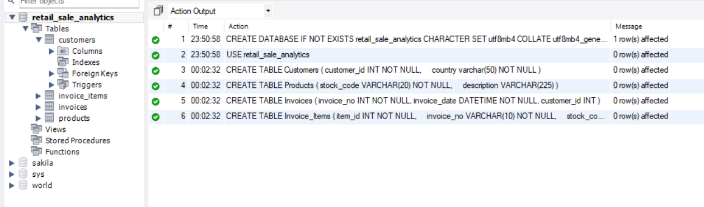

`DESCRIBE invoice_items` confirming the primary key and auto-increment behavior:

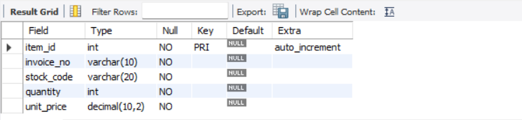

## 8–9. Foreign Keys & Relationships

Foreign keys link `invoices → customers`, `invoice_items → invoices`, and `invoice_items → products`. Delete behavior was set deliberately, not left to default: `RESTRICT` protects customer and product sales history from accidental deletion, while `invoice_items → invoices` uses `CASCADE`, since a line item has no independent meaning without its parent invoice.

The live schema, reverse-engineered directly from the database to confirm it matches the original design:

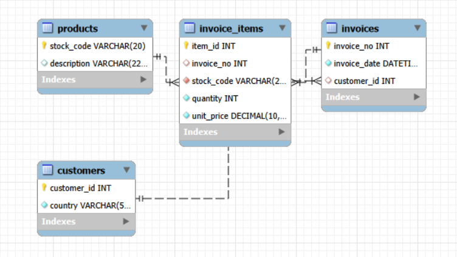

---

## 10. Importing the CSV

Rather than importing directly into the four normalized tables, the raw file was first loaded into a permissive **staging table** (`staging_online_retail`, all columns `VARCHAR`) via `LOAD DATA LOCAL INFILE` — the standard high-performance bulk-load approach for a file of this size.

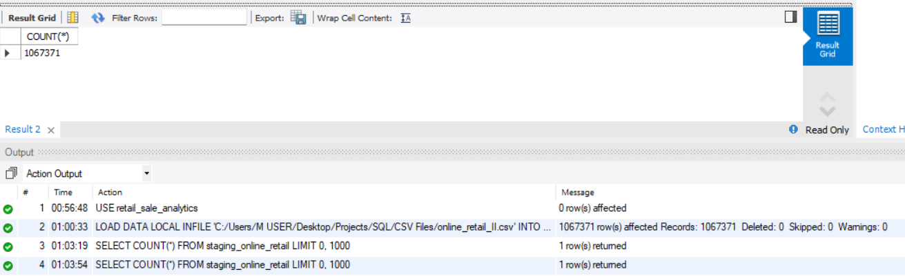

## 11. Data Validation

Before any cleaning, the staging data was systematically profiled with diagnostic SQL — quantifying exactly what was wrong before deciding how to fix it.

**Missing values** (note: distinguishing true `NULL` from empty string `''`, which behave differently in SQL):

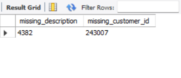

**Cancelled orders** (invoice numbers prefixed `C`):

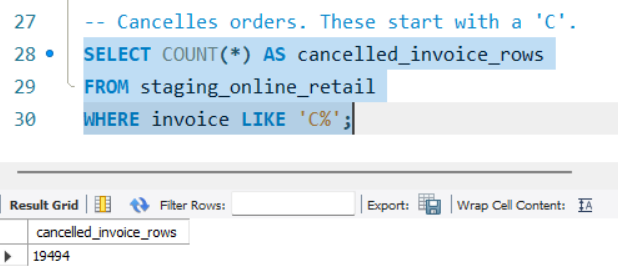

**Negative quantities and zero/negative prices:**

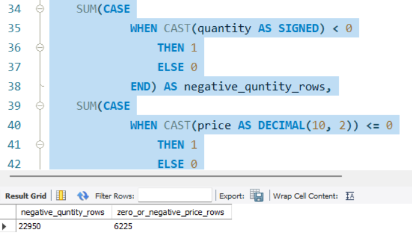

**Stock codes with inconsistent descriptions** — the same `GROUP BY` / `HAVING` pattern later formalized in the querying phase:

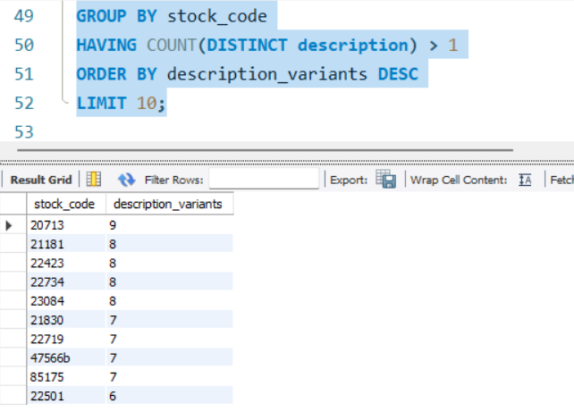

**Exact full-row duplicates:**

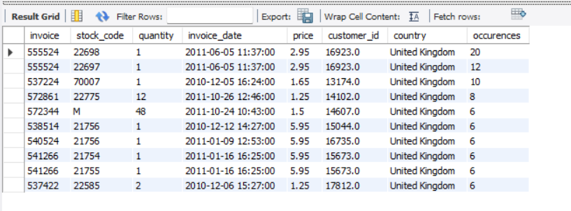

Findings were consolidated into a single validation summary before any cleaning began:

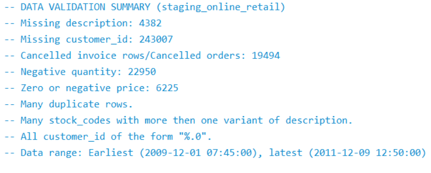

## 12. Data Cleaning

Every finding above was resolved into an explicit, documented decision — never a silent deletion:

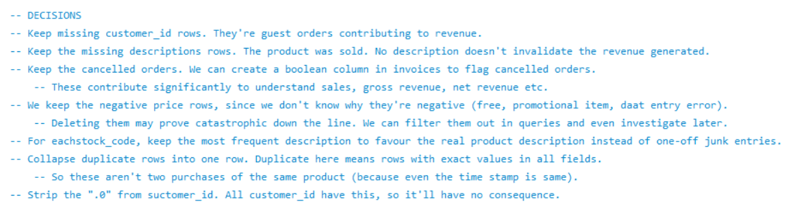

Mid-cleaning, a real bug surfaced: 6 rows with invoice numbers prefixed `A` (not `C`) turned out to be "Adjust bad debt" accounting entries — not product sales — discovered via a genuine `Error 1366` while populating `invoices`. These were excluded from the retail schema entirely, since they don't represent a customer purchasing a product and would have corrupted product-level revenue analysis.

`customers`, `products`, `invoices`, and `invoice_items` were then populated from the cleaned staging data, respecting foreign key dependency order. Final verification:

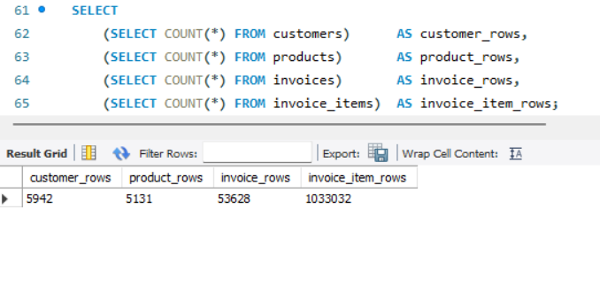

---

## 13–14. Querying, Filtering & Sorting

With clean data in place, `WHERE`, `LIKE`, `ORDER BY`, and multi-table `JOIN`s were used to answer targeted questions — for example, the highest-priced, non-cancelled sales of any product with "LIGHT" in its name:

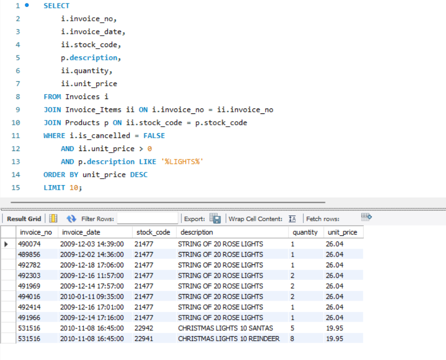

## 15. Aggregate Functions

Company-wide totals, computed directly from the cleaned `invoice_items` table:

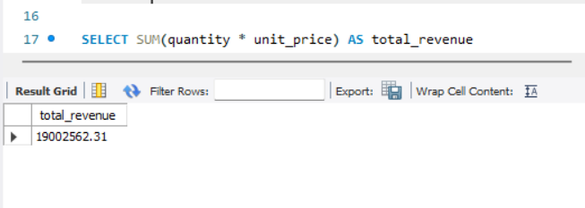

## 17. JOINs

The full four-table chain (`invoices → customers → invoice_items → products`) reunites the normalized data for real analysis — here, the 10 highest-value line items company-wide:

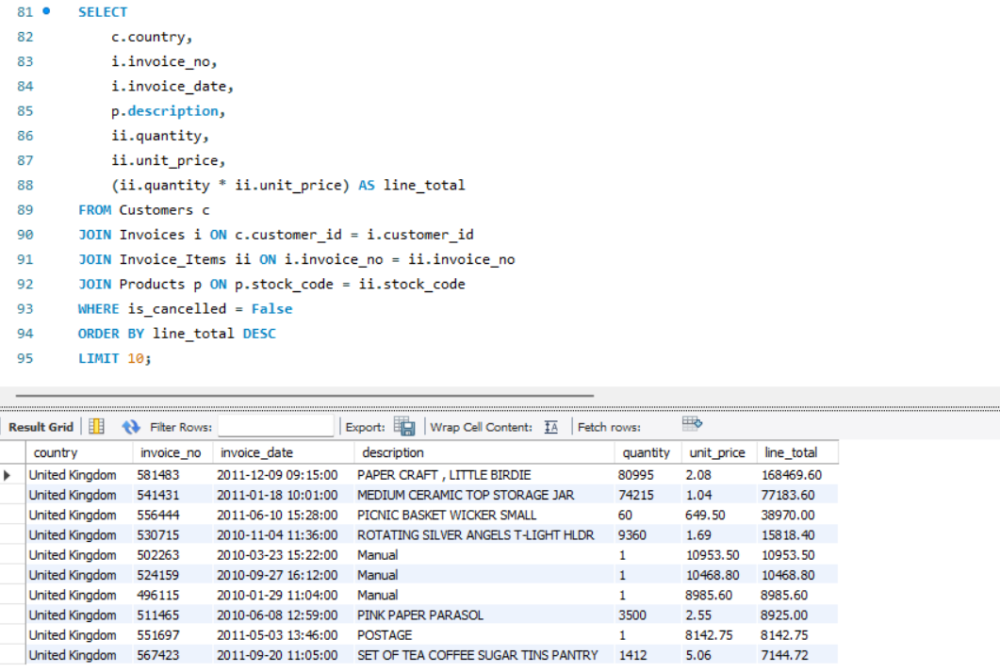

## 18. Subqueries

A direct demonstration of why a derived table (subquery in `FROM`) is necessary for "average per invoice" questions. A naive aggregate answers the wrong question — it averages per **line item**, not per **order**:

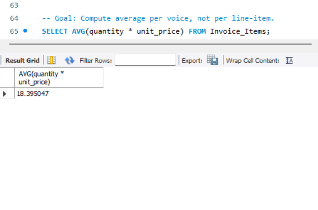

Wrapping a `GROUP BY` subquery in an outer `AVG()` answers the intended question correctly — the true average value of a full order:

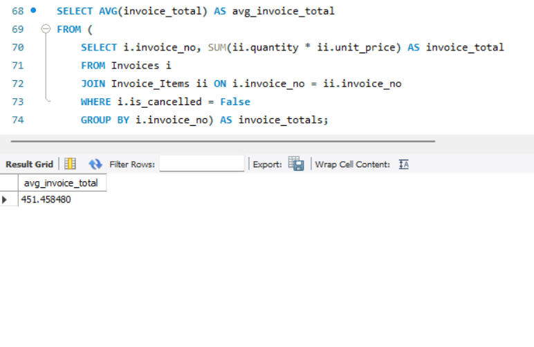

## 19. Views

Complex, reusable queries were saved as views — a single, consistent source of truth instead of repeatedly hand-written JOINs. `vw_customer_lifetime_value` surfaces top customers by total historical revenue in one line of SQL:

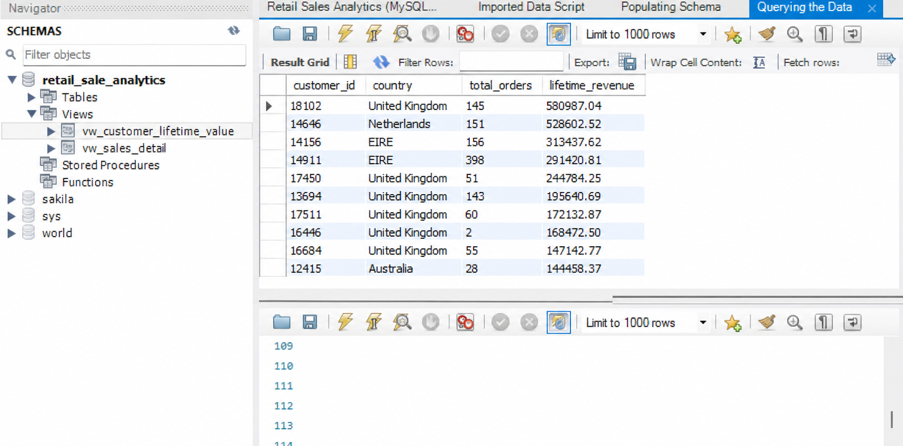

## 20. Indexes

`EXPLAIN` was used to prove a real performance improvement, not just assume one. After adding an index on `invoice_date`, a date-range query examined **1,575 rows instead of ~50,000** — MySQL switched from a full table scan to an indexed range scan:

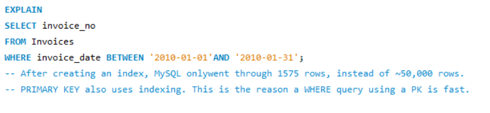

---

## Key Engineering Decisions

| Decision | Reasoning |
|---|---|
| `unit_price` stored in `invoice_items`, not `products` | Preserves historical accuracy if prices change over time |
| `invoices.customer_id` nullable | Guest orders are real transactions, not data errors |
| Cancelled orders and zero-price rows kept, not deleted | Preserves revenue accuracy; filtered at query time instead |
| Staging table used before final tables | Guarantees the full raw file loads safely before any type/constraint enforcement |
| Most-frequent description kept per stock code | Automatically favors real product names over rare manual-entry junk |
| "Adjust bad debt" (`A`-prefix) rows excluded | Accounting write-offs, not product sales — out of scope for a sales schema |
| `ON DELETE RESTRICT` on product/customer FKs, `CASCADE` on invoice→line-item | Protects historical data by default; cascades only where child rows have no independent meaning |

## Final Row Counts

| Table | Rows |
|---|---|
| `customers` | 5,942 |
| `products` | 5,131 |
| `invoices` | 53,628 |
| `invoice_items` | 1,033,032 |

---

## What This Project Demonstrates

- Schema design and normalization from a real, messy source file
- Primary/foreign key design, including deliberate `ON DELETE` behavior
- ETL practice: staging → validation → documented cleaning → load
- Debugging real constraint and type-mismatch errors during a live import
- Filtering, aggregation, `GROUP BY`/`HAVING`, multi-table JOINs, and subqueries
- Views for reusable, consistent reporting logic
- Query performance analysis and indexing with `EXPLAIN`
